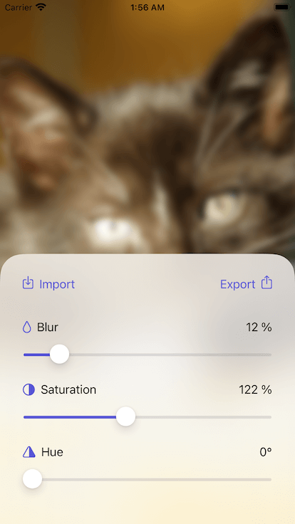
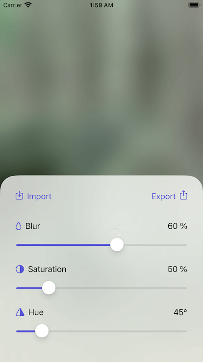
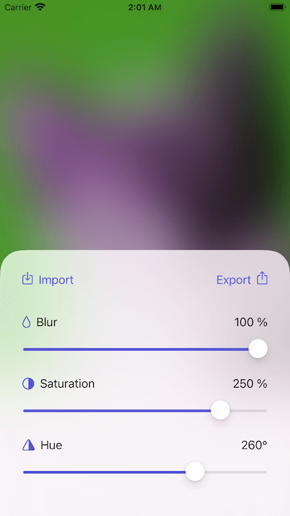

# Wallpapers Studio (iOS app)

## 📝 Description

This iOS application allows you to easily create wallpaper for your phone from the photos in your Photo Library.

1. Import image from Photo Library
2. Adjust position and scale by dragging and pinching the image
3. Apply blur and adjust saturation and hue rotation using sliders
4. Export cropped wallpaper image to Photo Library

|🖼|🖼|🖼|
|:-:|:-:|:-:|
||||

## 🛠 Tech stack

- [Xcode](https://developer.apple.com/xcode/) v12.0
- [Swift](https://swift.org/) v5.3
- [ComposableArchitecture](https://github.com/pointfreeco/swift-composable-architecture) v0.8.0

Application is build using **SwiftUI** and **ComposableArchitecture** frameworks.

## ☕️ Do you like the project?

## 📄 License

Copyright © 2020 Dariusz Rybicki Darrarski

License: [MIT](LICENSE)
